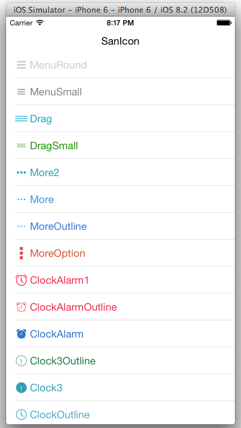

# SanIcon-Swift
Selected Icon font with IonIcon, Font Awesome, Entypo. In Swift.



## Getting Started
A. Copy `SanIcon` into your project.

B. Info.plist Settings. Add "Fonts provided by application" item by clicking on the "+" icon, then set "Item 0" with value "sanicon.ttf".

## Sample Code

#### Use ionicons with `UILabel`:

```swift

var label = UILabel();
label.text = String.sanicon(.ArrowUp);
label.font = UIFont.saniconFontOfSize(20);
```
Also work with `UIButton`, ...

#### Use ionicons with `SILabel`

```swift

var label = SILabel();
label.text = "Albums";
label.iconName = .Albums;
//label.iconColor = 0xffaa99ff;
//label.iconSize = 22;
//label.iconPadding = 5;
```

## Reference
* [Complete icon List](http://sanfriend.com/lab/sanicon)

## License
MIT License.
